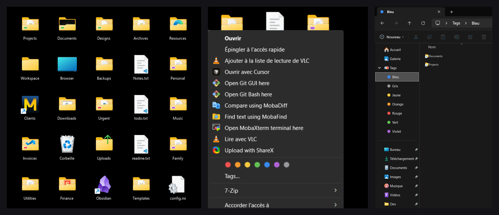
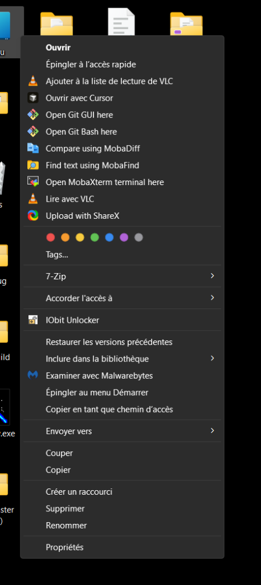
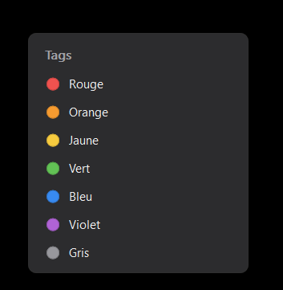
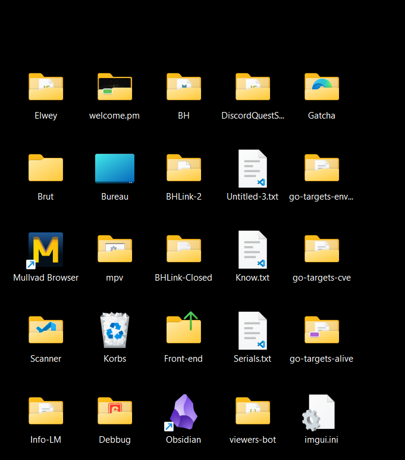
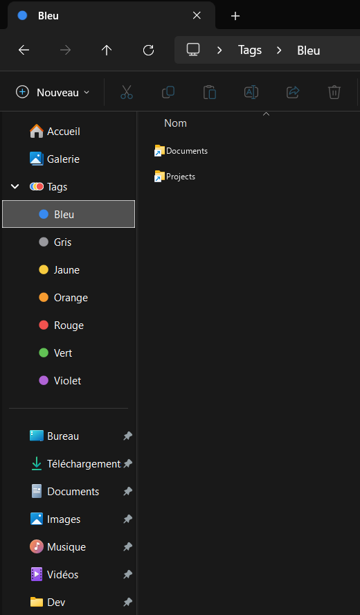

# desktop-folder-tags

<p align="center">
  <strong>Brings native macOS Finder-style colored tags & folder badges to Windows 11 and 10.</strong><br>
  <em>Les étiquettes et pastilles de couleur de macOS Finder portées nativement sur Windows 11 et 10.</em>
</p>

<p align="center">
  
</p>

<p align="center">
  <a href="#english">English</a> • <a href="#français">Français</a>
</p>

---

<a name="english"></a>
## 🇬🇧 English

### 🍎 Inspired by macOS Finder

Apple's colored folder tags are widely recognized as one of the fastest, most intuitive ways to categorize projects, prioritize documents, and visually organize your desktop. 

On Windows, organizing folders has historically meant custom icons or third-party software running heavy background processes. **desktop-folder-tags** brings the true macOS tagging workflow directly into the Windows Shell:
- **Zero background processes**: Written in pure C++ / Win32. No Electron, no resident tray app, no CPU/RAM overhead.
- **Pixel-perfect folder badges**: Modern rounded rectangle badges with white borders and subtle drop shadows, precisely calibrated to sit harmoniously on the folder's front flap across different icon sizes.
- **1-Click context menu**: Tag folders instantly using the row of colored dots directly in the modern Windows 11/10 context menu.
- **Finder-style sidebar ("Tags")**: A dedicated *Tags* root folder in the File Explorer navigation pane, automatically categorized by color with shortcuts to all tagged folders.
- **Persistent NTFS metadata**: Tags are stored in NTFS Alternate Data Streams (`:FolderTags.Tags`), meaning your tags stay attached to the folder even when renamed or moved across the same disk!

---

### ✨ Features

| Feature | Description |
| :--- | :--- |
| **7 Signature Colors** | Red, Orange, Yellow, Green, Blue, Purple, and Gray matching macOS color semantics. |
| **Instant Right-Click Tagging** | Modern dot row in the Explorer context menu for quick toggling. |
| **Adaptive Badges** | Calibrated geometry for Desktop Medium view, Medium + 1 wheel notch, and Large icons. |
| **Explorer Navigation Pane** | Pinned *Tags* tree under Quick Access / Home with subfolders for each color. |
| **Advanced Tags Window** | A modal dialog to manage multiple tags and inspect current assignments. |
| **Rock-Solid Reliability** | Pre-warmed shell icon overlay slots to ensure all 7 colors render immediately without Explorer cache starvation. |

---

### 📸 Screenshots

<div align="center">

| Context Menu Quick Tagging | Tags Manager Window |
| :---: | :---: |
|  |  |

| Desktop Folder Badges | Explorer Sidebar Integration |
| :---: | :---: |
|  |  |

</div>

---

### 🚀 Installation & Usage

#### Option A: Quick Install (Pre-built Release - Recommended)
No compiler or developer tools required:
1. Download the latest `desktop-folder-tags-v1.0.0.zip` from [Releases](https://github.com/bhpdev1/desktop-folder-tags/releases).
2. Extract the ZIP archive to a folder.
3. Double-click **`install.bat`** (or right-click `install.ps1` and select *Run with PowerShell*).
4. Explorer restarts automatically — you can now right-click any folder to tag it!

To uninstall anytime, simply double-click **`uninstall.bat`**.

#### Option B: Build from Source
##### Prerequisites
- Windows 10 or Windows 11 (64-bit)
- Visual Studio 2022 (with *Desktop development with C++*) or MSVC Build Tools
- CMake 3.20+

##### 1. Clone the repository
```powershell
git clone https://github.com/bhpdev1/desktop-folder-tags.git
cd desktop-folder-tags
```

##### 2. Build & Install
Run the provided automated PowerShell scripts:
```powershell
# Compile the native 64-bit shell extension DLL
.\scripts\build.ps1

# Register COM classes, initialize icons & restart Explorer
.\scripts\install.ps1
```

> **Note**: `install.ps1` registers the extension in `HKEY_CURRENT_USER` and automatically restarts `explorer.exe` to refresh icon cache and shell overlays.

##### 3. Uninstallation
To completely remove the extension:
```powershell
.\scripts\uninstall.ps1
```

---

### ⚙️ Technical Architecture

- **Shell Extension DLL (`FolderTags.dll`)**: Implements `IShellExtInit`, `IContextMenu3`, and `IShellIconOverlayIdentifier`.
- **Storage Layer**: Uses NTFS stream `<folder>:FolderTags.Tags` (similar to macOS xattrs). File timestamps remain untouched.
- **Dynamic GDI+ Multi-Frame ICO**: Generates DPI-aware uncompressed 32bpp DIB frames (16 to 128px) at runtime into `%LOCALAPPDATA%\FolderTags\icons\`.
- **Explorer Overlay Warm-up**: Automatically forces Windows Explorer to pre-load overlay image list slots for all 7 colors at startup.

---

<br>

<a name="français"></a>
## 🇫🇷 Français

### 🍎 Inspiré de macOS Finder

Sous macOS, les étiquettes de couleur du Finder font partie des fonctionnalités les plus pratiques pour classer ses projets en un coup d'œil.

Sur Windows, ce niveau d'intégration manquait ou nécessitait des applications tierces lourdes en arrière-plan. **desktop-folder-tags** recrée fidèlement cette expérience directement dans l'Explorateur Windows :
- **100% Natif & Ultra-léger** : Développé en C++ / Win32 pur. Zéro processus résident, zéro framework lourd, consommation CPU/RAM nulle au repos.
- **Pastilles calées au millimètre** : Badges rectangulaires arrondis avec liseré blanc et ombre portée subtile, ajustés précisément sur le rabat des dossiers.
- **Menu contextuel en 1 clic** : Rangée de pastilles de couleur intégrée au menu clic droit de Windows 11 et 10.
- **Volet de navigation "Tags"** : Arborescence "Tags" épinglée dans le panneau latéral de l'Explorateur pour retrouver tous les dossiers d'une même couleur en un clic.
- **Stockage NTFS pérenne** : Les étiquettes sont stockées dans les flux de données NTFS alternatifs (`:FolderTags.Tags`) : elles suivent vos dossiers lors des renommages ou déplacements sur le même lecteur sans polluer votre disque.

---

### ✨ Fonctionnalités

- **7 Couleurs macOS** : Rouge, Orange, Jaune, Vert, Bleu, Violet et Gris.
- **Marquage instantané** : Clic droit sur un dossier → clic sur la pastille voulue.
- **Badges adaptatifs** : Position et taille calculées selon l'affichage (icônes moyennes, moyennes + 1 cran de molette, grandes).
- **Raccourcis automatiques** : Visualisation centralisée dans `%LOCALAPPDATA%\FolderTags\Tags`.
- **Préchauffage intelligent** : Résolution du comportement de l'Explorateur pour que les 7 couleurs s'affichent immédiatement sans redémarrage.

---

### 🚀 Installation et Utilisation

#### Option A : Installation rapide (Release pré-compilée - Recommandé)
Aucun compilateur ni outil de développement requis :
1. Téléchargez la dernière version `desktop-folder-tags-v1.0.0.zip` dans l'onglet [Releases](https://github.com/bhpdev1/desktop-folder-tags/releases).
2. Décompressez l'archive ZIP dans un dossier.
3. Double-cliquez sur **`install.bat`** (ou clic droit sur `install.ps1` → *Exécuter avec PowerShell*).
4. L'Explorateur redémarre automatiquement — vous pouvez dès à présent faire un clic droit sur vos dossiers pour leur attribuer une couleur !

Pour désinstaller à tout moment, double-cliquez simplement sur **`uninstall.bat`**.

#### Option B : Compiler depuis les sources
##### Prérequis
- Windows 10 ou 11 (64-bit)
- Visual Studio 2022 (avec les outils C++) ou Build Tools MSVC
- CMake 3.20 ou supérieur

##### 1. Cloner le projet
```powershell
git clone https://github.com/bhpdev1/desktop-folder-tags.git
cd desktop-folder-tags
```

##### 2. Compiler et Installer
```powershell
# Compiler la DLL 64-bit
.\scripts\build.ps1

# Installer et redémarrer l'Explorateur
.\scripts\install.ps1
```

##### 3. Désinstallation
```powershell
.\scripts\uninstall.ps1
```

---

## 📄 Licence
Ce projet est open-source sous licence MIT.
