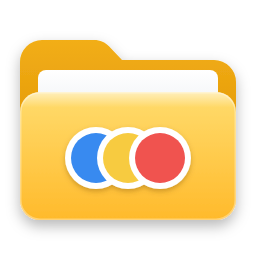
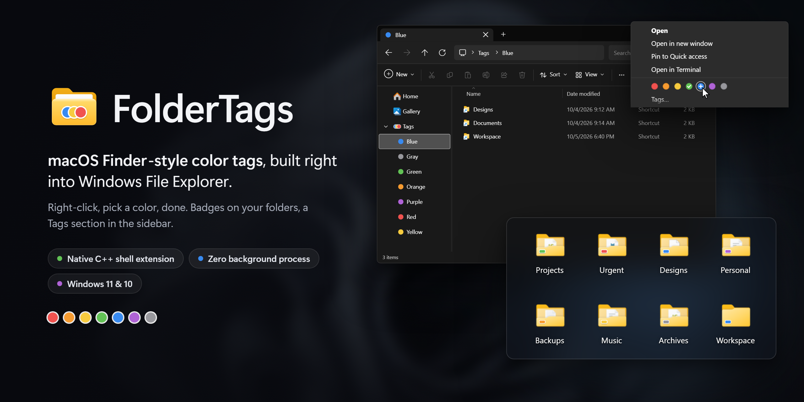
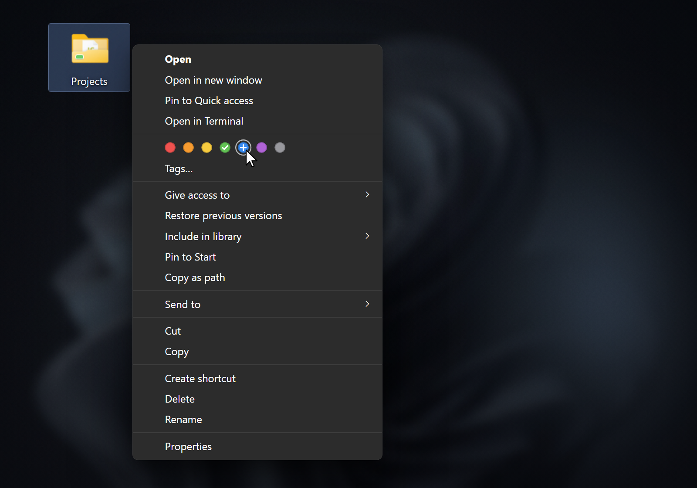
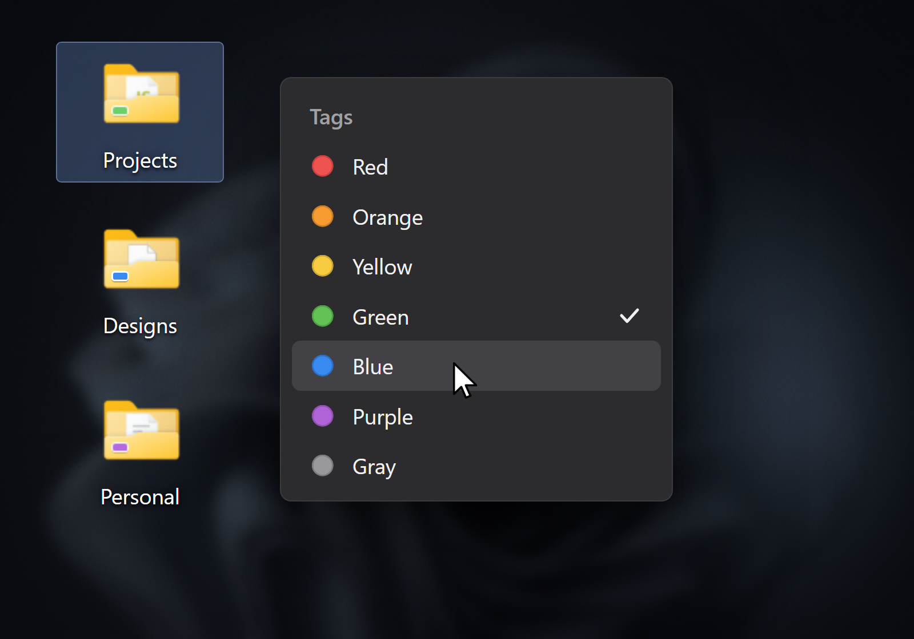
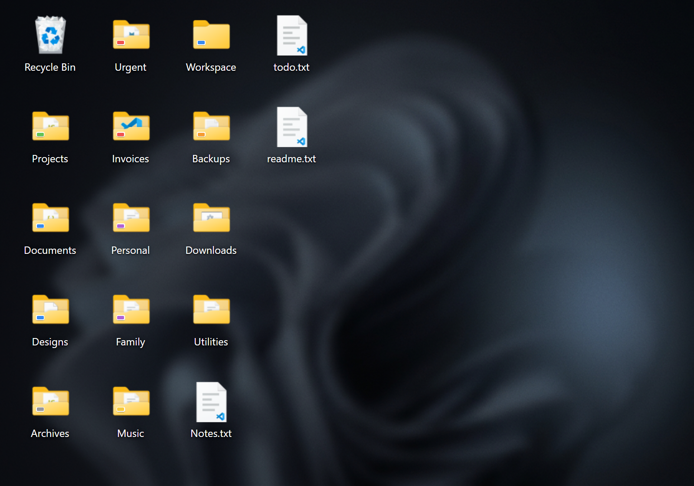
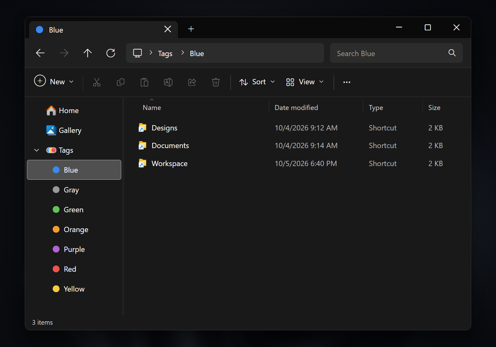

<div align="center">



# FolderTags

**macOS Finder-style color tags, built right into Windows File Explorer.**<br>
<em>Les étiquettes de couleur du Finder de macOS, intégrées nativement à l'Explorateur Windows.</em>

<a href="https://github.com/bhpdev1/FolderTags/releases/latest"></a>


<br><br>



<a href="#english">English</a> • <a href="#français">Français</a>

</div>

---

<a name="english"></a>
## 🇬🇧 English

### 🍎 Inspired by macOS Finder

Apple's colored folder tags are widely recognized as one of the fastest, most intuitive ways to categorize projects, prioritize documents, and visually organize your desktop. 

On Windows, organizing folders has historically meant custom icons or third-party software running heavy background processes. **FolderTags** brings the true macOS tagging workflow directly into the Windows Shell:
- **Zero background processes**: Written in pure C++ / Win32. No Electron, no resident tray app, no CPU/RAM overhead.
- **Pixel-perfect folder badges**: Modern rounded rectangle badges with white borders and subtle drop shadows, precisely calibrated to sit harmoniously on the folder's front flap across different icon sizes.
- **1-Click context menu**: Tag folders instantly using the row of colored dots directly in the modern Windows 11/10 context menu.
- **Finder-style sidebar ("Tags")**: A dedicated *Tags* root folder in the File Explorer navigation pane, automatically categorized by color with shortcuts to all tagged folders.
- **Persistent NTFS metadata**: Tags are stored in NTFS Alternate Data Streams (`:FolderTags.Tags`), meaning your tags stay attached to the folder even when renamed or moved across the same disk!

---

### ✨ Features

| Feature | Description |
| :--- | :--- |
| **7 Signature Colors** | Red, Orange, Yellow, Green, Blue, Purple, and Gray matching macOS color semantics. |
| **Instant Right-Click Tagging** | Modern dot row in the Explorer context menu for quick toggling. |
| **Adaptive Badges** | Calibrated geometry for Desktop Medium view, Medium + 1 wheel notch, and Large icons. |
| **Explorer Navigation Pane** | Pinned *Tags* tree under Quick Access / Home with subfolders for each color. |
| **Advanced Tags Window** | A modal dialog to manage multiple tags and inspect current assignments. |
| **Rock-Solid Reliability** | Pre-warmed shell icon overlay slots to ensure all 7 colors render immediately without Explorer cache starvation. |
| **English & French UI** | English by default, French automatically on French Windows. |

---

### 📸 Screenshots

<div align="center">

| One-click tagging from the context menu | Tags window for multi-selection |
| :---: | :---: |
|  |  |
| **Badges on desktop folders** | **Tags sidebar in File Explorer** |
|  |  |

<sub>UI mockups reproduced from FolderTags' actual rendering (same badge geometry, icons and menu metrics).</sub>

</div>

---

### 🚀 Installation & Usage

#### Option A: Quick Install (Pre-built Release - Recommended)
No compiler or developer tools required:
1. Download the latest `FolderTags-v1.1.0.zip` from [Releases](https://github.com/bhpdev1/FolderTags/releases).
2. Extract the ZIP archive to a folder.
3. Double-click **`install.bat`** (or right-click `install.ps1` and select *Run with PowerShell*).
4. Accept the one-time administrator prompt (UAC): it registers the 7 badge overlays for Explorer.
5. Explorer restarts automatically — you can now right-click any folder to tag it!

To uninstall anytime, simply double-click **`uninstall.bat`**.

> [!NOTE]
> Windows only shows about 11 third-party icon overlays system-wide. FolderTags uses 7 of them and sorts ahead of OneDrive, so some of OneDrive's sync badges may stop showing.

#### Option B: Build from Source
##### Prerequisites
- Windows 10 or Windows 11 (64-bit)
- Visual Studio 2022 (with *Desktop development with C++*) or MSVC Build Tools
- CMake 3.20+

##### 1. Clone the repository
```powershell
git clone https://github.com/bhpdev1/FolderTags.git
cd FolderTags
```

##### 2. Build & Install
Run the provided automated PowerShell scripts:
```powershell
# Compile the native 64-bit shell extension DLL
.\scripts\build.ps1

# Register COM classes, initialize icons & restart Explorer
.\scripts\install.ps1
```

> **Note**: `install.ps1` registers the COM classes in `HKEY_CURRENT_USER`, then self-elevates once to list the 7 overlays under `HKEY_LOCAL_MACHINE`, and restarts `explorer.exe` to refresh the icon cache.

##### 3. Uninstallation
To completely remove the extension:
```powershell
.\scripts\uninstall.ps1
```

---

### ⚙️ Technical Architecture

- **Shell Extension DLL (`FolderTags.dll`)**: Implements `IShellExtInit`, `IContextMenu3`, and `IShellIconOverlayIdentifier`.
- **Storage Layer**: Uses NTFS stream `<folder>:FolderTags.Tags` (similar to macOS xattrs). File timestamps remain untouched.
- **Dynamic GDI+ Multi-Frame ICO**: Generates DPI-aware uncompressed 32bpp DIB frames (16 to 128px) at runtime into `%LOCALAPPDATA%\FolderTags\icons\`.
- **Explorer Overlay Warm-up**: Automatically forces Windows Explorer to pre-load overlay image list slots for all 7 colors at startup.
- **Localization**: Tag folders use stable English ids on disk (`Tags\blue`); the displayed name comes from `desktop.ini` (`LocalizedResourceName`), so it follows the Windows UI language without renaming anything.

---

### 📄 License

This project is licensed under the **GNU General Public License v3.0** — see the [LICENSE](LICENSE) file for details.

---

<br>

<a name="français"></a>
## 🇫🇷 Français

### 🍎 Inspiré de macOS Finder

Sous macOS, les étiquettes de couleur du Finder font partie des fonctionnalités les plus pratiques pour classer ses projets en un coup d'œil.

Sur Windows, ce niveau d'intégration manquait ou nécessitait des applications tierces lourdes en arrière-plan. **FolderTags** recrée fidèlement cette expérience directement dans l'Explorateur Windows :
- **100% Natif & Ultra-léger** : Développé en C++ / Win32 pur. Zéro processus résident, zéro framework lourd, consommation CPU/RAM nulle au repos.
- **Pastilles calées au millimètre** : Badges rectangulaires arrondis avec liseré blanc et ombre portée subtile, ajustés précisément sur le rabat des dossiers.
- **Menu contextuel en 1 clic** : Rangée de pastilles de couleur intégrée au menu clic droit de Windows 11 et 10.
- **Volet de navigation "Tags"** : Arborescence "Tags" épinglée dans le panneau latéral de l'Explorateur pour retrouver tous les dossiers d'une même couleur en un clic.
- **Stockage NTFS pérenne** : Les étiquettes sont stockées dans les flux de données NTFS alternatifs (`:FolderTags.Tags`) : elles suivent vos dossiers lors des renommages ou déplacements sur le même lecteur sans polluer votre disque.

---

### ✨ Fonctionnalités

- **7 Couleurs macOS** : Rouge, Orange, Jaune, Vert, Bleu, Violet et Gris.
- **Marquage instantané** : Clic droit sur un dossier → clic sur la pastille voulue.
- **Badges adaptatifs** : Position et taille calculées selon l'affichage (icônes moyennes, moyennes + 1 cran de molette, grandes).
- **Raccourcis automatiques** : Visualisation centralisée dans `%LOCALAPPDATA%\FolderTags\Tags`.
- **Préchauffage intelligent** : Résolution du comportement de l'Explorateur pour que les 7 couleurs s'affichent immédiatement sans redémarrage.
- **Interface FR / EN** : En français sur un Windows français, en anglais partout ailleurs.

Captures : voir la section [Screenshots](#-screenshots) (maquettes fidèles au rendu réel).

---

### 🚀 Installation et Utilisation

#### Option A : Installation rapide (Release pré-compilée - Recommandé)
Aucun compilateur ni outil de développement requis :
1. Téléchargez la dernière version `FolderTags-v1.1.0.zip` dans l'onglet [Releases](https://github.com/bhpdev1/FolderTags/releases).
2. Décompressez l'archive ZIP dans un dossier.
3. Double-cliquez sur **`install.bat`** (ou clic droit sur `install.ps1` → *Exécuter avec PowerShell*).
4. Acceptez l'invite administrateur (UAC), demandée une seule fois pour enregistrer les 7 pastilles dans l'Explorateur.
5. L'Explorateur redémarre automatiquement — vous pouvez dès à présent faire un clic droit sur vos dossiers pour leur attribuer une couleur !

Pour désinstaller à tout moment, double-cliquez simplement sur **`uninstall.bat`**.

> [!NOTE]
> Windows n'affiche qu'environ 11 overlays d'icônes tiers sur tout le système. FolderTags en utilise 7 et passe devant OneDrive : certains badges de synchronisation OneDrive peuvent ne plus s'afficher.

#### Option B : Compiler depuis les sources
##### Prérequis
- Windows 10 ou 11 (64-bit)
- Visual Studio 2022 (avec les outils C++) ou Build Tools MSVC
- CMake 3.20 ou supérieur

##### 1. Cloner le projet
```powershell
git clone https://github.com/bhpdev1/FolderTags.git
cd FolderTags
```

##### 2. Compiler et Installer
```powershell
# Compiler la DLL 64-bit
.\scripts\build.ps1

# Installer et redémarrer l'Explorateur
.\scripts\install.ps1
```

##### 3. Désinstallation
```powershell
.\scripts\uninstall.ps1
```

---

## 📄 Licence
Ce projet est open-source sous licence **GNU General Public License v3.0 (GPLv3)** — voir le fichier [LICENSE](LICENSE) pour plus de détails.
